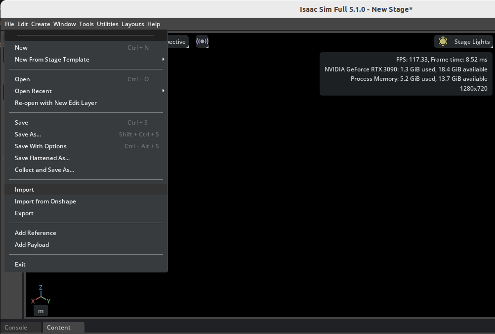
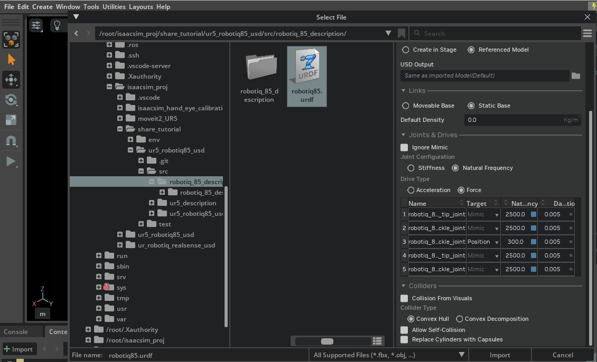
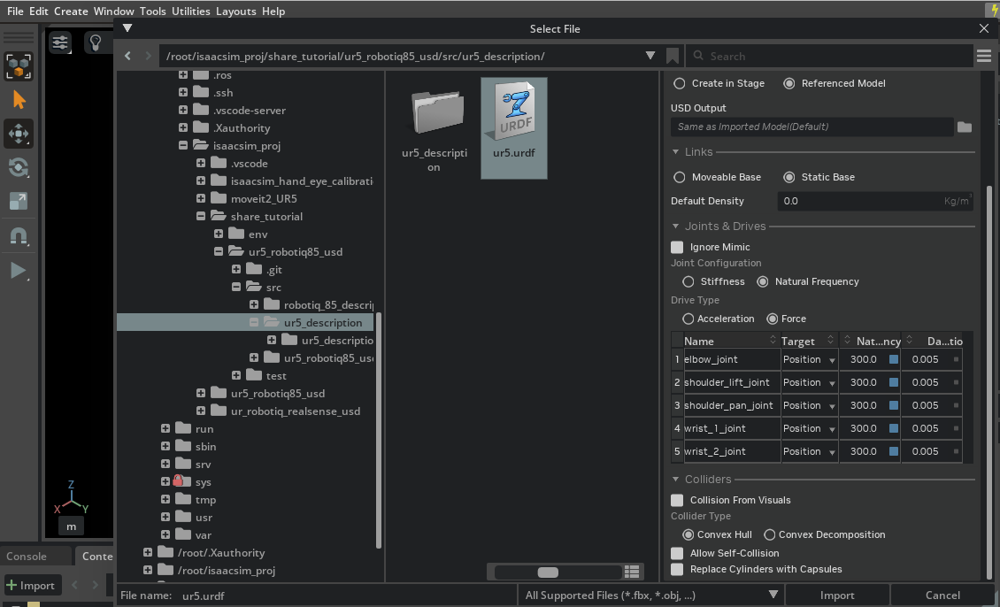
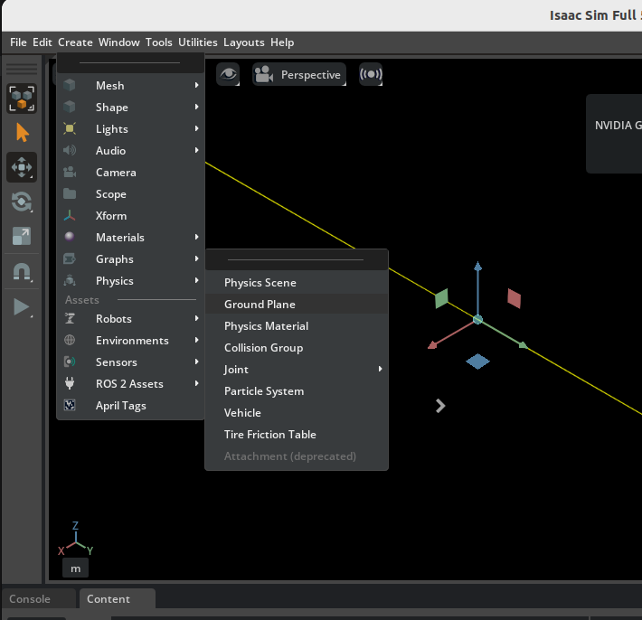
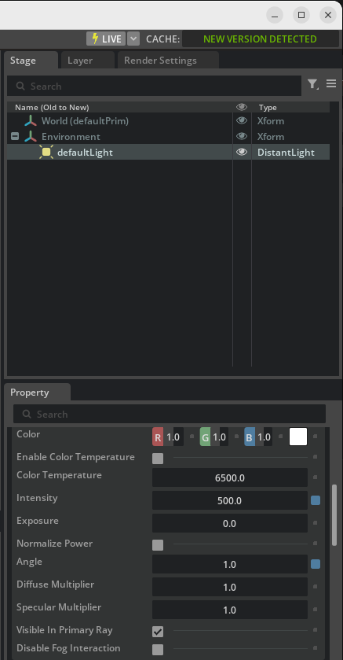
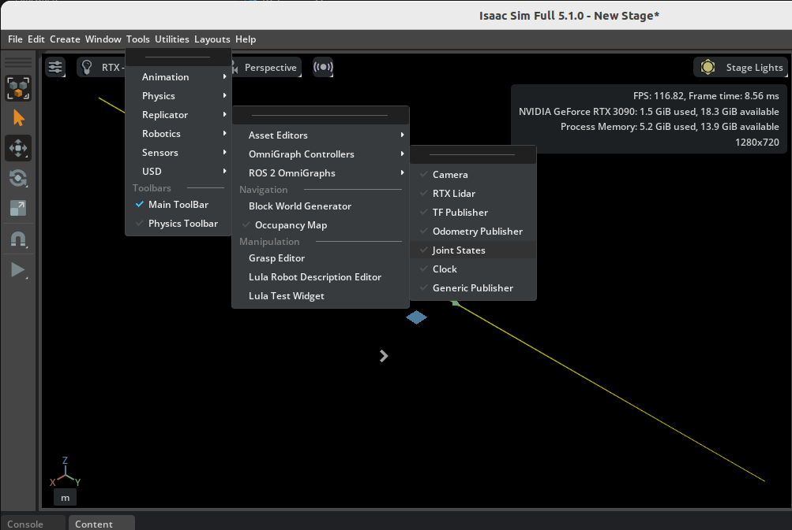
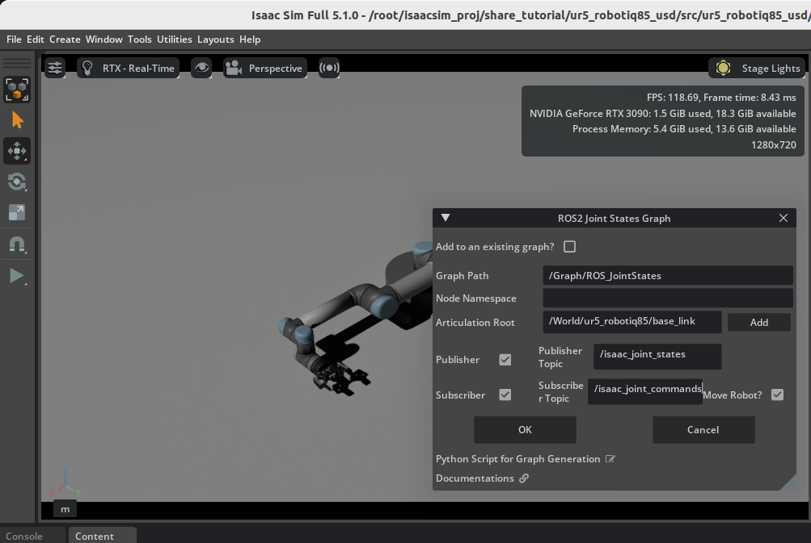

# Create UR5 & Robotiq85 USD

### 环境配置
- ubuntu24.04
- isaacsim 5.1

### isaacsim import urdf
1. 打开import窗口


2. import robotiq设置


3. import ur设置


### ur5 & robotiq85 connection
1. 本仓库参考[Tutorial 6: Setup a Manipulator](https://docs.isaacsim.omniverse.nvidia.com/5.1.0/robot_setup_tutorials/tutorial_import_assemble_manipulator.html)的option1实现夹爪与机械臂的连接

### make scene
1. 添加地面


2. 设置光源


3. 设置action graph
- 打开设置窗口


- 设置参数



### launch simulation by python script
1. 调用test/simu.py
- 启动仿真(有GUI, 仿真无限长时间)：
```bash
/isaac-sim/python.sh src/test/simu.py --usd usd_full_path
```

- 无GUI运行300帧，用于快速检查场景能否加载和仿真
```bash
/isaac-sim/python.sh src/test/simu.py --headless --steps 300 --usd usd_full_path
```

### 说明
1. prepare urdf，这里UR5和robotiq85 urdf是分别导入isaac sim的, 需要在ros2环境中奖xacro转成urdf:
- xacro导出urdf
```
xacro robotiq_85_gripper_standalone.urdf.xacro > robotiq85.urdf # export robotiq85 urdf

xacro ur5_standalone.urdf.xacro > ur5.urdf # export ur5 urdf
```

- 将文件夹结构调整成：
```
/folder_name_A/
├── urdf_file
└── folder_name_B
    └── meshes
        ├── collision
        └── visual
```


### 参考
1. isaac sim官方教程：[Tutorial 6: Setup a Manipulator](https://docs.isaacsim.omniverse.nvidia.com/5.1.0/robot_setup_tutorials/tutorial_import_assemble_manipulator.html)

2. URDF代码仓库：[ur5_robotiq85_description](https://github.com/WAI-f/ur5_robotiq85_description)
